# Assessment of the U.S. Labor Market: Trends and Changes Post-Pandemic (2019-2024)

## Project Overview

The labor market is a critical indicator of economic health, influencing productivity, consumer spending, and overall economic growth. The aim of this project is to investigate the impact on the U.S. labor market over the past five years, with a focus on understanding the long-term impacts of the COVID-19 pandemic on employment levels, job openings, wage growth, and workforce participation, as well as the broader implications for economic recovery and growth.

Key objectives for this project include:
1. Analysing employment trends across sectors to identify growth areas (sectors) and potential risks.
2. Analysing sector-specific job openings across different industries to understand how shifts in sectoral hiring patterns reflect broader economic conditions.
3. Evaluating wage growth and income inequality (Gini coefficient) and its implications for economic stability.
4. Assessing labor force participation and factors affecting it (e.g., demographic changes, education).

# Tools Utilized
For my analysis, I displayed use of several key tools:

- Python: Enables analysis of the imported data to find critical insights. I also used the following Python libraries:
  - Pandas Library: Used to manipulate and analyze the data.
  - Matplotlib Library: Used to visualize the data.
  - Plotly Express & Seaborn Library: Helped me create more advanced customizations and interactive plots.
- Jupyter Notebooks: The tool I used to run my Python scripts which includes my notes and analysis.
- Visual Studio Code: For executing my Python scripts.
- Git & GitHub: Essential for version control and sharing my Python code and analysis, ensuring project tracking.

To  gather relevant economic data for this project, I utilized the FRED API wrapper (fredapi) provided by the Federal Reserve Economic Data (FRED) system. Using 
the fredapi library, I was able to retrieve a variety of  datasets such as non-farm payrolls (NFP), job openings, labor force participation rates and other economic indicators.

# Importing libraries & FRED API wrapper

``` Python
#importing libraries
import pandas as pd 
import numpy as np
import matplotlib.pyplot as plt
import plotly.express as px
import seaborn as sns 
from plotly.subplots import make_subplots
```

```Python
#import fredapi key
from fredapi import Fred

from dotenv import load_dotenv
import os

#Load variables from .env
load_dotenv() 
fred_key = os.getenv("FRED_API_KEY")

#create fred object
fred = Fred(api_key=fred_key)
```

# The Analysis

## 1. Employment Trends

View my notebook with detailed steps here:
[01_Employment_Trends.ipynb](01_Employment_Trends.ipynb)

## Results: NFP Trends
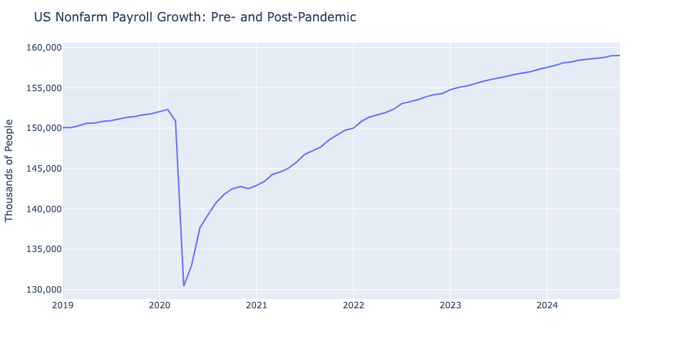
*Figure 1: Non-farm payroll 5-year overview*

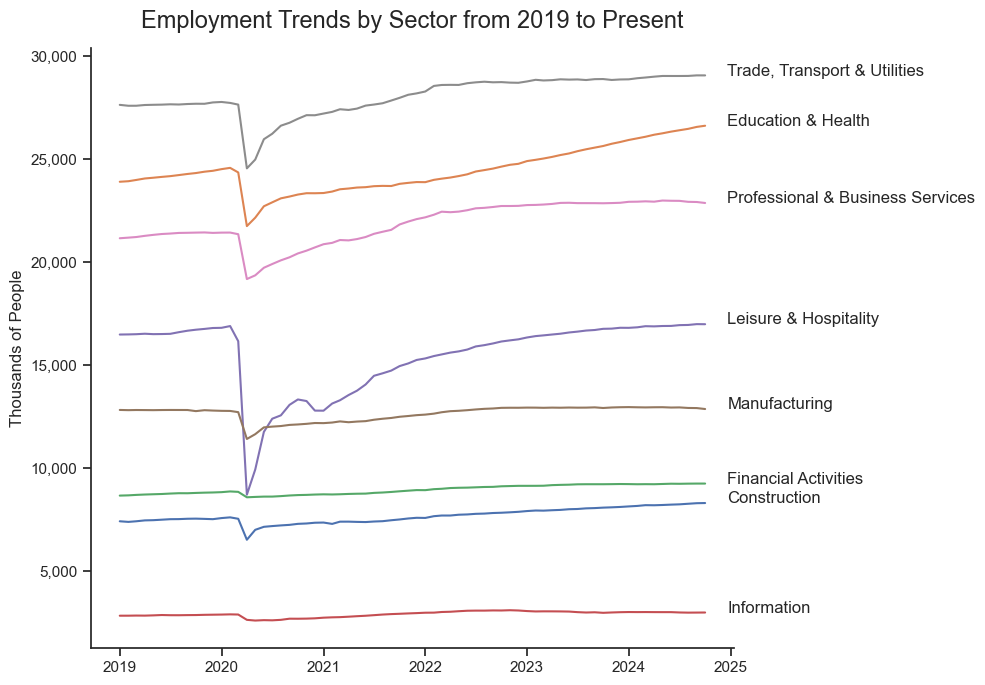
*Figure 2: Trends in employment by sector over the past 5 years*

## Insights
- **Figure 1** shows an increase in the number of people employed before the pandemic (2019-early 2020), indicating a growing labor market, The labor market was adding jobs consistently, with total employment reaching around 152,000,000 people before early 2020. 
  
- Following the introduction of COVID restrictions early 2020, there is an obersvable sharp decline in the number of payrolls. As a result, employment levels dropped to as low as 130,000,000 which corresponsd to a loss of 22 million jobs in a few months. This reflects the massive job losses due to widespread lockdowns, business closures, and economic uncertainty.
- Recovery in employment levels can be seen to have started around mid-2020, with payrolls steadily increasing as businesses reopened and economic activity resumed following easing of COVID restrictions. The recovery appears consistent, though the growth rate shows slight decelerations in late 2020 and 2022. 
- By 2023-2024 the number of jobs has largely plateaued near 160,000,000, (having already surpassed the pre-pandemic level of employment). This indicates the labor market has fully recovered from the initial shock of the pandemic and might now be operating near full employment.
  
&nbsp;

- **Figure 2** shows a similar trend in employment across all sectors, with the 2020 dip highlighting the significant impact of the pandemic. However, the magnitude of recovery varies with some sectors.

- The graph shows the majority of workers are in the  ‘Trade, Education & Utilities’ and ‘Education & Health’ sectors. They show consistent upward trends, indicating robust growth in these sectors over time. Their consistent growth implies these industries' resilience and growing labor demand.
- Leisure & Hospitality experienced the sharpest drop during the 2020 COVID-19 pandemic given the face-to-face nature of these roles but has since shown a strong recovery. 
- Sectors like Financial Services and Construction appear to have relatively stable employment levels, and don’t seem to be largely impacted by the pandemic. Conversely, manufacturing displays a more stagnant response podt-pandemic, suggesting limited growth potential in recent years.

## Results: Net Change in Employment by sector      


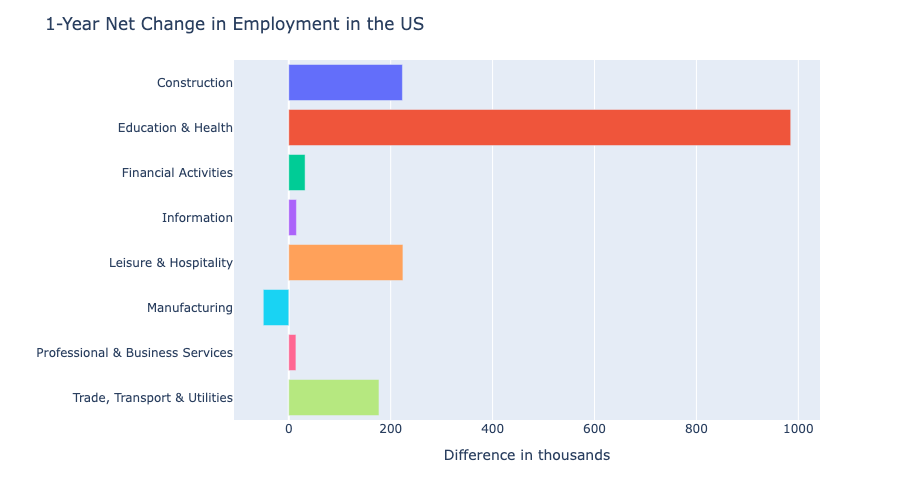
*Figure 3: 1-Year net change in employment by sector*


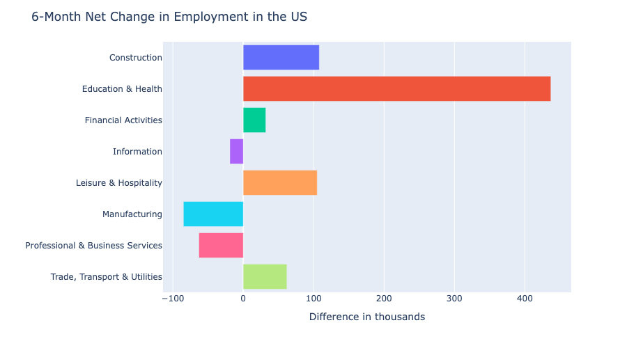
*Figure 4: 6-month net change in employment by sector*


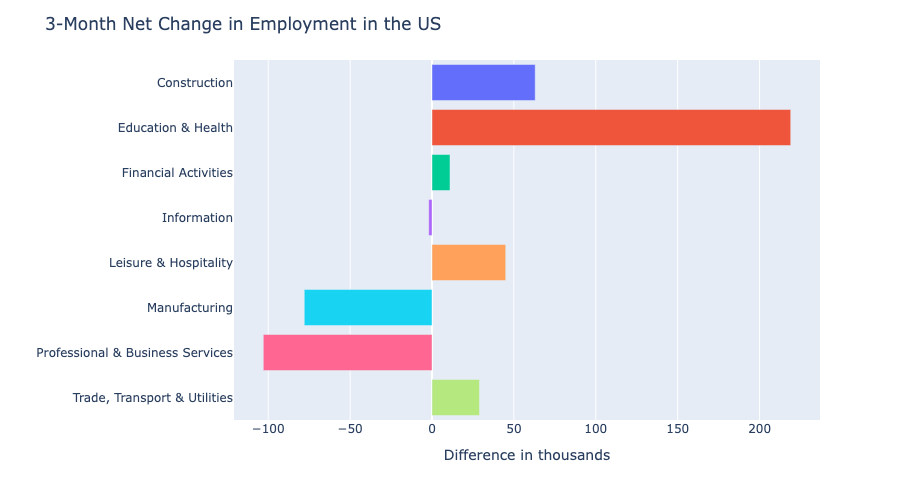
*Figure 5: 3-month net change in employment by sector*

## Insights
- **Figures 3, 4 and 5** shows the greatest net increase in the number of employed workers is in the education & health sector across all three time periods, with approximately a 900,000 increase in workers over a year period. This reinforces its consistent demand and importance in opportunity creation/job productivity. 
- There is also a significant increase in employees working in contruction and leisure & hospitality sectors in the short-term and long-term, both of which display a net increase of around 220,000 workers over this past year. This could reflect more investment opportunities in real estate as well as increased consumer confidence/expanision and tourism and travel.
- Out of all sectors, the manufacturing sector has seen a net decrease in the number of employed workers in the past year. Interstingly, in the past 3 months, there has been a 100,000 decrease in those working in professional and business services.


## 2. Job Openings

View my notebook with detailed steps here:
[02_Job_Openings.ipynb](02_Job_Openings.ipynb)

## Results
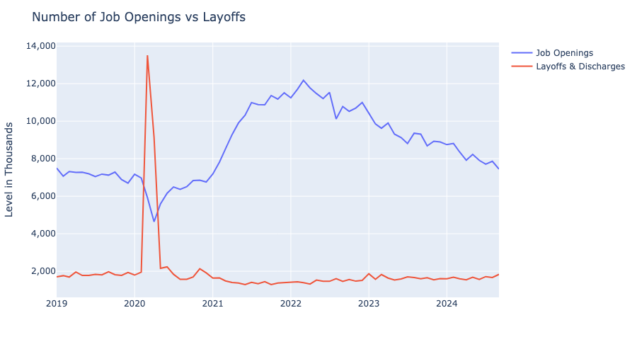
*Figure 1: Job Openings vs Layoffs*

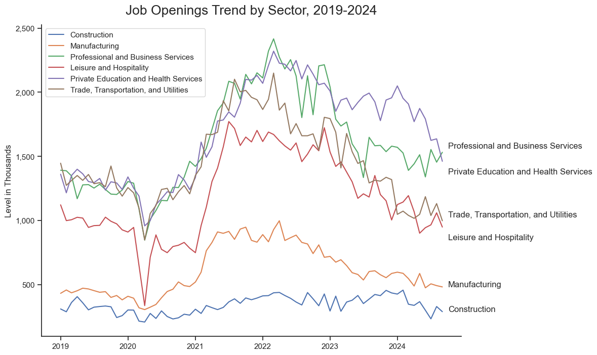
*Figure 2  : Job Openings Trend by sector*

## Insights

- Prior to the pandemic in **Figure 1**, job openings remained relatively stable at ~ 7 million, with the number of layofss remaining low, between 1.8 to 2 million. 
  
- Early 2020 shows a signficiant drop in job openings, falling below 5 million jobs as hiring came to a reduction. Conversely,  layoffs and discharges spiked dramatically in early 2020, peaking above 12 million. This reflects the widespread job losses due to the lockdown.
- Job openings rebounded quickly and surged to new highs, peaking at around 12 million on March 2022 following reopening of businesses. In addition, layoffs sharply decreased by mid-2020, stabilising to  around pre-pandemic levels (2 million)
- Over the past 2 years, there has been a decline in job openings (from mid-2022 onwards), falling to around 8 million by 2024. This suggests a cooling labor market, potentially due to tighter monetary policies or saturation of hiring in some sectors (around this time, interest rates were risen).  Layoffs have remained low and stable, around 1.5-2 million. 

&nbsp;

- From **Figure 2**, we see that most sectors experienced a surge in job openings around 2021-2022, likely due by to strong demand for labor post-pandemic. However, the sharp decrease across multiple job sectors post-2022 indicates a cooling labor market, mediated by other economic factors such as inflation, interest rates, consumer confidence etc. 
  
- Professional and Business Services & the Private Education and Health Services show the greatest number of job openings following a similar upwards trend post-pandemic, but after start of 2020, there has been a pullback in the number of openings avilable (with this pullback much more prominent in Private Education & Health Services).
- Trade, Transport & Utilities maintained moderate levels in job openings throughout this period.  Leisure & Hospitality saw the largest dip during 2020 due to pandemic restrictions, but recovered strongly in an attempt to boost consumer spending during easing of restrictions. 
- The Construction sector consistently has the lowest level of job openings across the observed period, but display minimal fluctuations compared to other sectors.


## 3. Wage Growth

View my notebook with detailed steps here: 
[03_Wage_Growth.ipynb](03_Wage_Growth.ipynb) 

## Results
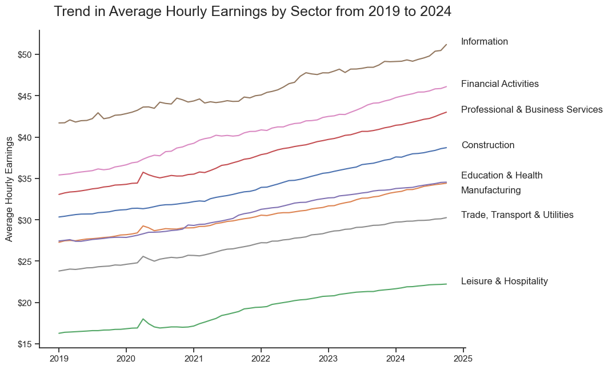
*Figure 1: Average Hourly Earnings Trend from 2019 to 2024*

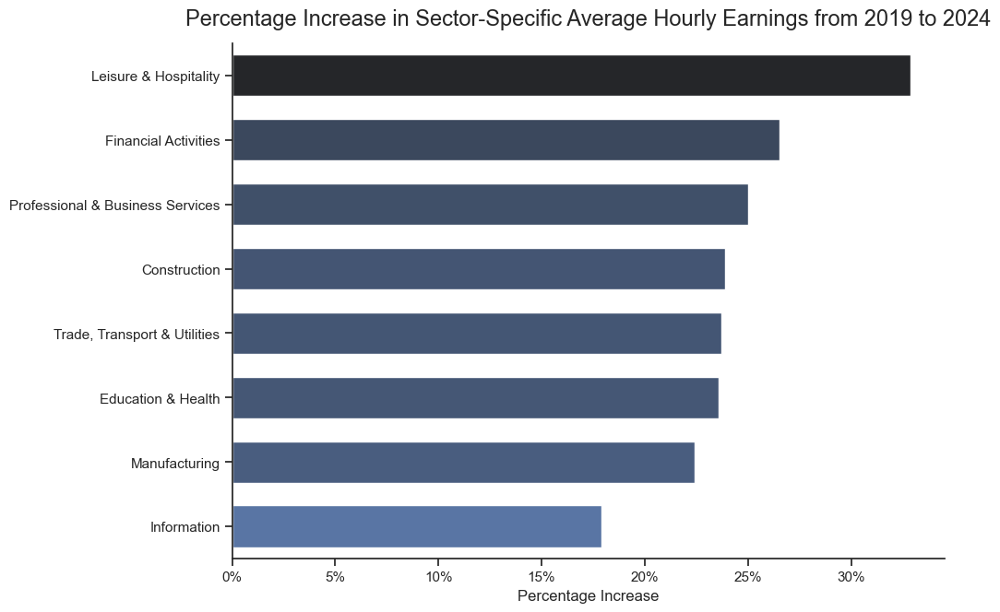
*Figure 2: Displays sectors with the greatest percentage increase in average hourly earnings, 2019 to 2024*

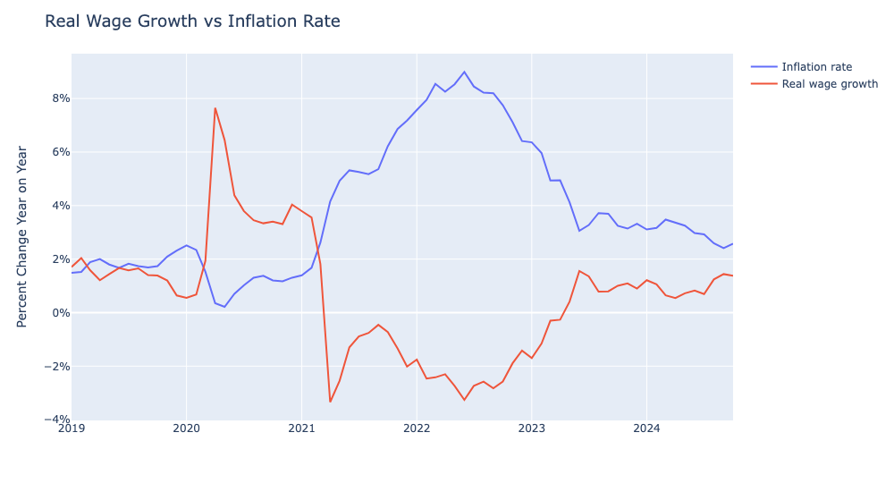
*Figure 3: Real Wage Growth plotted against Inflation Rate, rates calculated Year-on-Year*


## Insights
- **Figure 1** shows an overall upwards trend in average hourly earnings across all job sectors over the past 5 years. This reflects steady nominal wage growth (although this may not necessarily reflect an increase in purchasing power).
  
- The information sector has the greatest average hourly earnings, surpassing $50 per hour in recent months, reflecting the technical expertise/years of experience required for these high-paying roles. This is then followed by the financial activities and professional & business service sectors, with an average ranging from $40-$43 per hour, which too shows the pay for professionals who can contribute/genereate high returns for financial firms.
- Leisure & Hospitality notably has the lowest average hourly earning of ~$20-$22 per hour as these businesses may have tight margins/advertise entry level roles that doesn't require specialist knowledge. The trade, transport & utilites displays a slightly greater increase of ~$26 per hour.
  
&nbsp;

- **Figure 2** displays that over a 5-year period, leisure & hospitality sector saw the greatest percentage increase in average hourly earnings (>30%), followed by financial actvities and professional & business services sectors.

- On the other hand, information and manufacturing sectors saw the lowest increases in average hourly earnings, both of which are greater than 15%.

&nbsp;

- **Figure 3** shows that prior to the onset of the pandemic,  both real wage growth and inflation remained relatively stable and closely aligned, with real wage growth slightly above inflation.

- Inflation fell  during the early months of 2020  as economic activity slowed due to lockdowns and reduced demand. As a result, real wages surged during this period as inflation dropped and household income support was introduced.
- During towards late 2020/early 2021, inflation rose sharply whislt real wage growth turned negative during this period, as nominal wage increases failed to keep pace with accelerating inflation. 
- During the period between early 2021-early 2023, real wage growth has remained under 0% whilst inflation has reached rates greater than 8%.
- Over the past year, inflation appears to have stabilized, though it remains above pre-pandemic levels.  Real wage growth shows signs of recovery but still remains below inflation for much of the period, only starting to catch up with inflationary pressures.


## 4. Labour Participation

View my notebook with detailed steps here: 
[04_Labour_Participation.ipynb](04_Labour_Participation.ipynb)

## Results

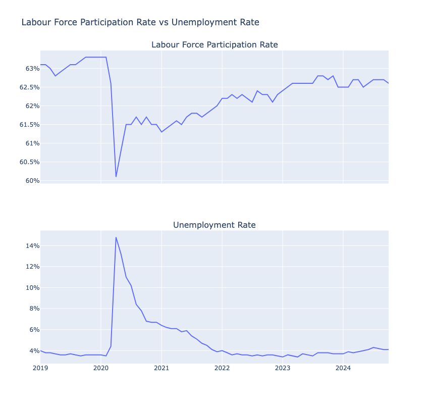
*Figure 1: Rates of labor force participation and inflation from 2019 to 2024*

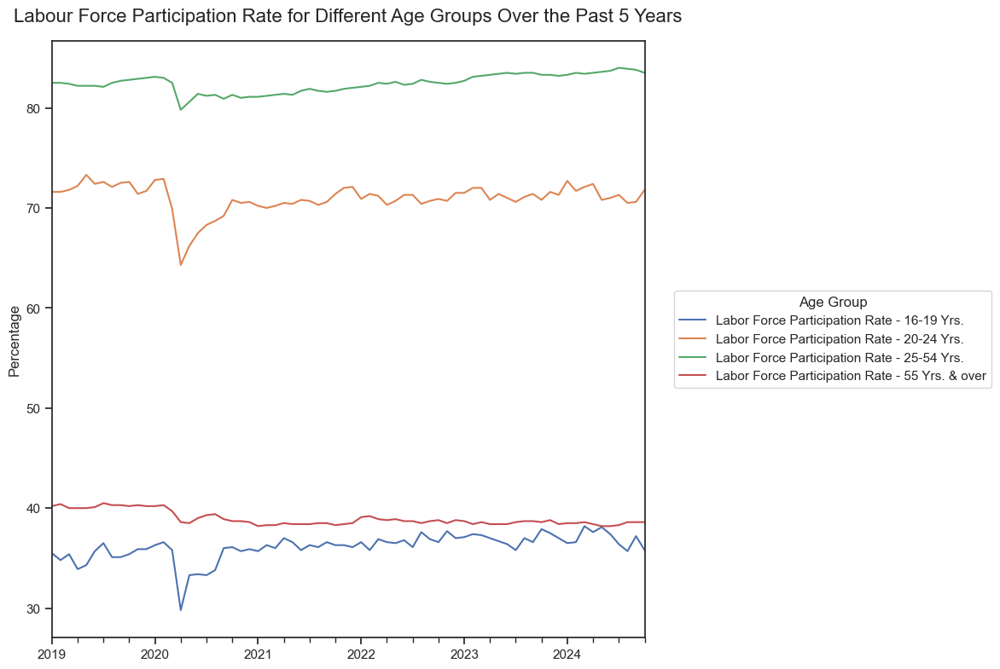
*Figure 2:  Labor force participation by age groups from 2019 to 2024*

## Insights
- **Figure 1**: A sharp decline in the labour force participation rate (LFPR) is observed in early 2020, dropping from about 63% to just above 60%. The unemployment rate spiked dramatically in 2020, reaching a peak of over 14%.

- After easing of COVID pandemic,  the LFPR begins to recover gradually but has yet to return to pre-pandemic levels by 2024. It stabilises around 62.5%, which is slightly below the pre-pandemic range of 63%. The unemployment rate declined rapidly from its 2020 peak, dropping below 5% by late 2021 and remaining at relatively low levels (around 4%) through 2024.

&nbsp;


- Across all age groups in **Figure 2**, a sharp decline is evident in 2020 due to the pandemic. This indicates widespread disruption across the labor market, but the degree of recovery varied. Younger workers (ages 16-24 years) were affected harder due to a high proportion working in sectors like retail and hospitality, which were heavily affected. Workers aged 25-54 years showed more resilience and a stronger recovery relfecting demand for more experienced workers. Workers aged greater than 55 years were the least affected by the pandemic.

- The age group of 16-19 years has the lowest LFPR, between ~30%-38%,  experiencing a significant drop in participation in 2020 with a partial recovery, although these rates are fluctuating. The 20-24 years age group have a LFPR at ~65%-72%, which is the second-highest out of all age groups. Desite the recovery following the  decline in 2020, the rate remains slightly below pre-pandemic levels.
- Workers aged 25-54 years shows the highest labor force participation rate, around 80-83% and has maintained a gradual upwards trend in recent years.
- Much older workers of ages greater than 55 have maintained a relatively  stable LFPR of around 38-40%, although the current rate is slightly lower than pre-pandemic levels.


# Discussion


# Next Steps


# Conclusion
